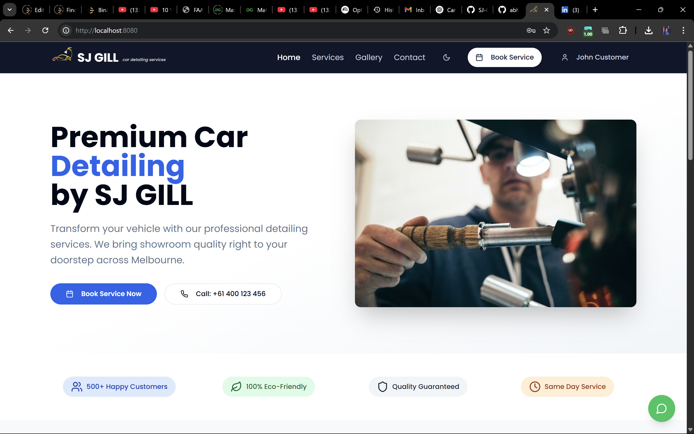
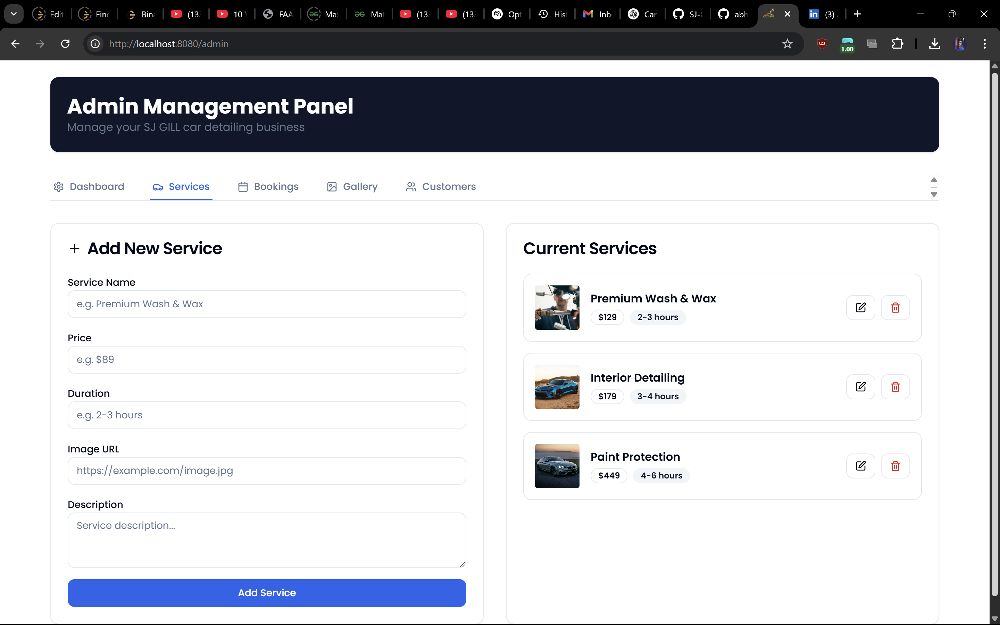
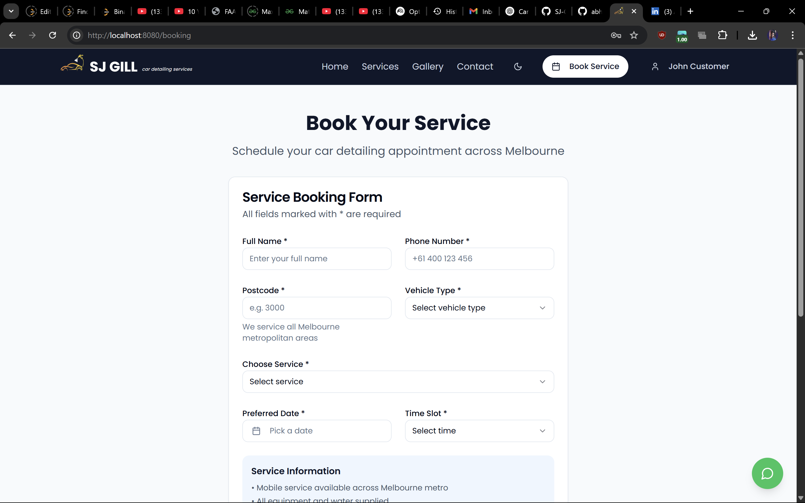
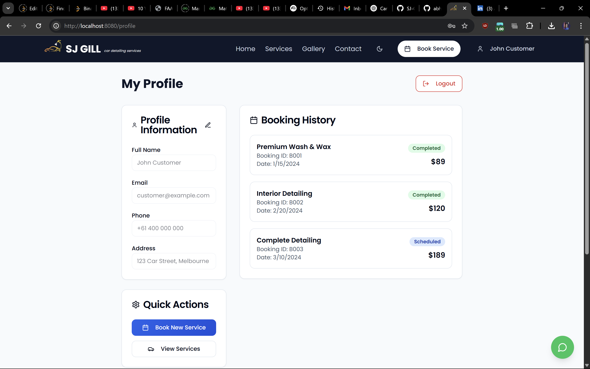

# 🚘 SJ-GILL Car Detailing Services

A modern, responsive front-end web application for a car detailing business built using **React**, **TypeScript**, **Tailwind CSS**, and **Vite**. It offers both a **customer-facing website** and an **admin dashboard** for managing services, bookings, gallery items, and customer records.

---

## 🌐 Live Website

🔗 **Visit here:** [https://sj-gill-car-detailing.vercel.app](https://sj-gill-car-detailing.vercel.app)  
> *(Update the link above if deployed elsewhere.)*

---

## 📸 Screenshots

### 🧼 Customer Website


### 🛠 Admin Dashboard


### 🛠 Booking Form


### 🛠 User Profile


---

## 🧭 Features Overview

### 🧑‍💼 Customer Website

| Page        | Features                                                                 |
|-------------|--------------------------------------------------------------------------|
| **Home**    | Hero section with brand info and navigation                             |
| **Booking** | Users can book services with contact info and date                      |
| **Services**| Lists premium car detailing services with price & duration              |
| **Gallery** | Showcases before/after images of real detailing jobs                    |
| **Contact** | Simple contact section for customer queries                             |
| **Login**   | (Optional) Admin login for dashboard access                             |

---

### ⚙️ Admin Panel

> A dedicated dashboard to manage core business operations.

#### 📊 Dashboard
- View summary cards: Total Bookings, Revenue, Active Services, and Gallery Items

#### 🧰 Services Management
- Add new services with title, price, duration, and image
- Edit or delete existing services

#### 🖼 Gallery Management
- Upload work with title, description, before/after images, customer name, and service performed
- Remove entries from gallery

#### 📅 Booking Management
- View list of customer bookings with status
- Displays name, phone, service, and date

#### 👥 Customer Records
- Track all customer data with email, phone, number of bookings, and total amount spent

---

## 🛠 Tech Stack

| Technology | Purpose                      |
|------------|------------------------------|
| React + TS | Component-based UI structure |
| Tailwind CSS | Styling & layout           |
| Vite       | Fast dev server & build tool |
| Lucide Icons | Elegant icons in UI        |
| Custom Hooks | Toast notifications        |

---

## 📁 Project Structure (Front-End)

<pre lang="text"> ``` front-end/ ├── public/ │ └── logo.png ├── src/ │ ├── pages/ │ ├── components/ │ ├── contexts/ │ ├── hooks/ │ ├── App.tsx │ └── main.tsx ├── index.html ├── tailwind.config.ts └── vite.config.ts ``` </pre>


## 🧪 Setup Instructions

# Clone the repository
git clone https://github.com/abhaygill/SJ-GILL-car-detailing-services.git
cd front-end

# Install dependencies
npm install

# Run in development
npm run dev

## 🙌 Author

**Abhay Singh Gill**  
📧 abhaygill8303@gmail.com  
🔗 [LinkedIn](https://www.linkedin.com/in/abhay-singh-gill-a10a2021a)  
🔗 [GitHub](https://github.com/abhaygill)
🔗 [Portfolio](https://abhayportfolio-sigma.vercel.app/)
